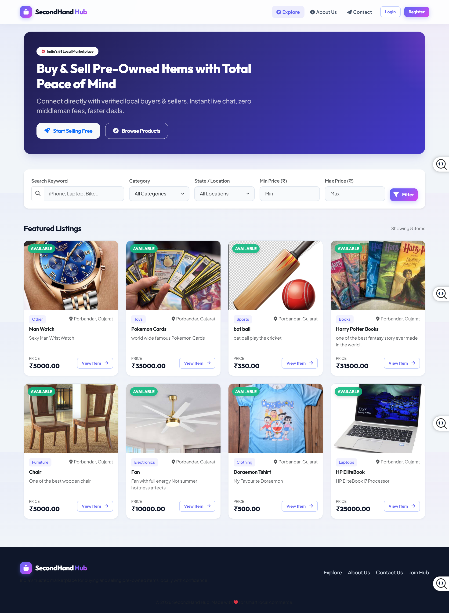
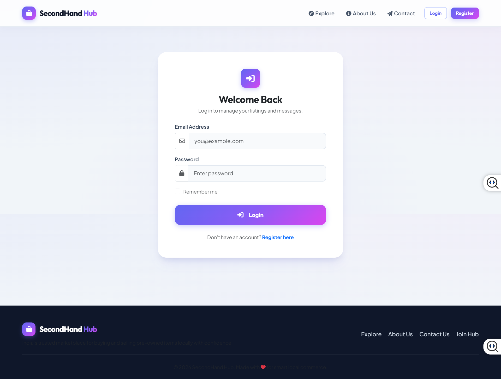
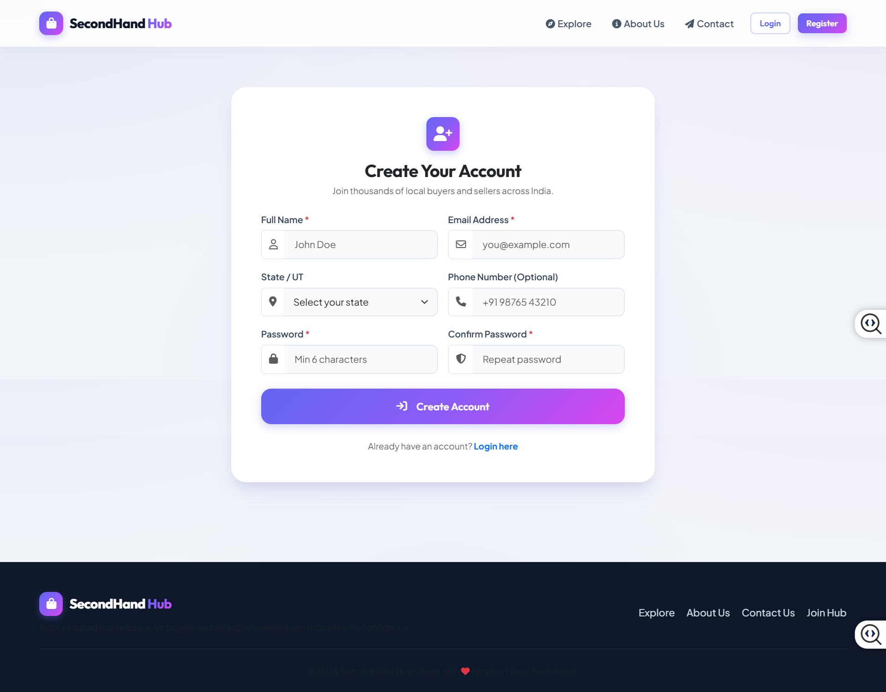
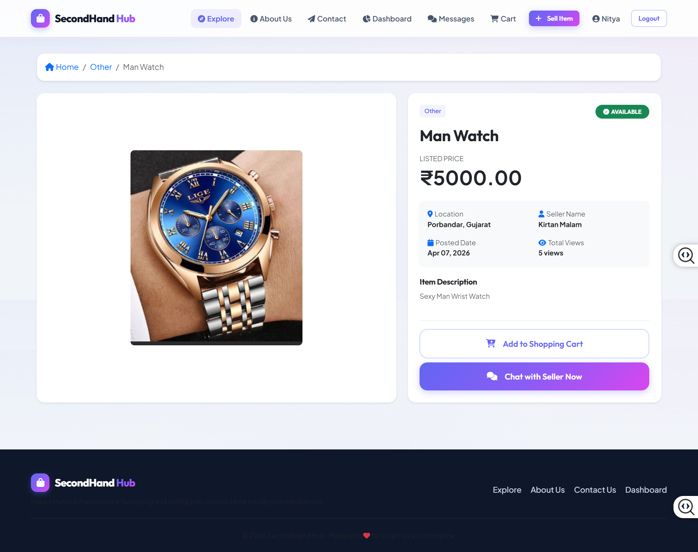
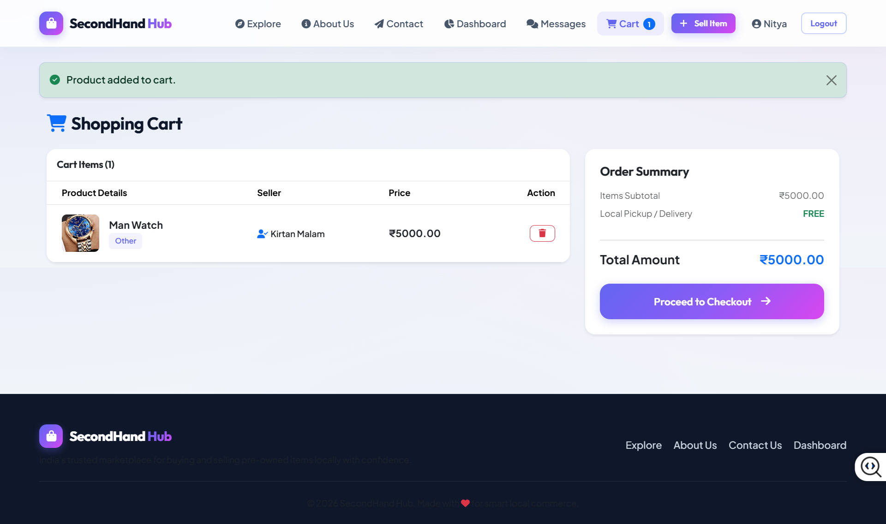
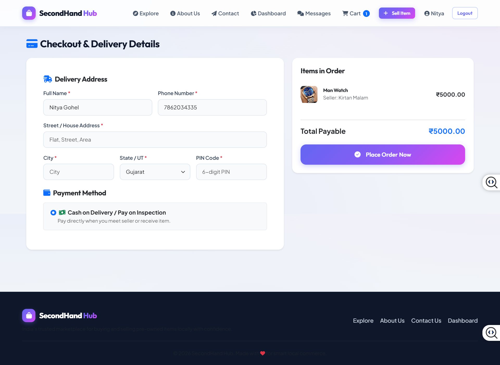
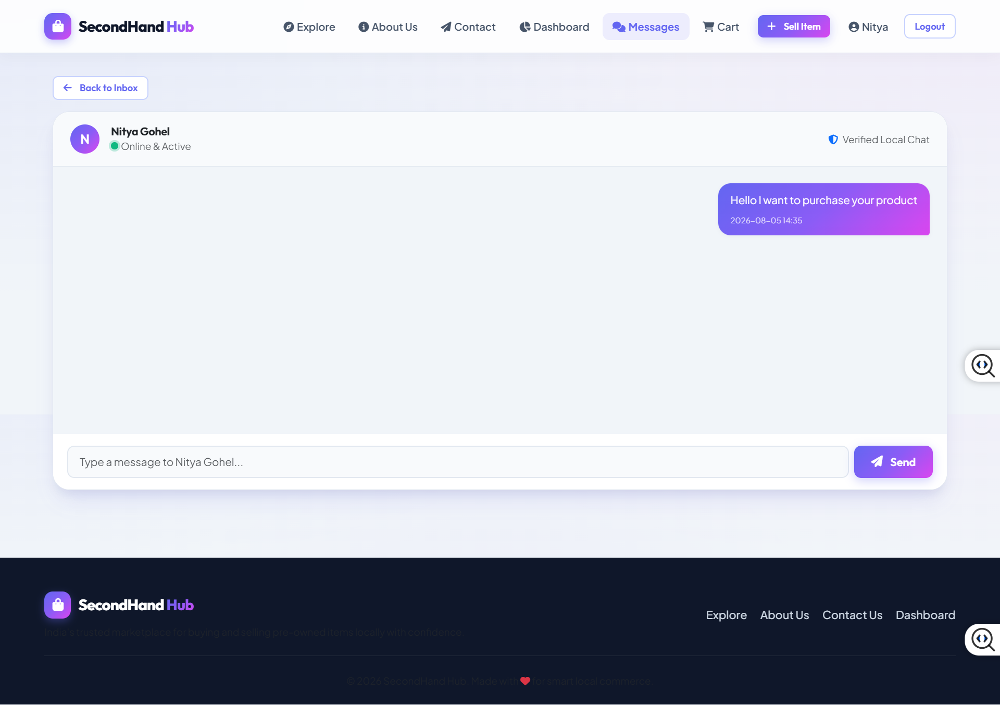

# 🛒 Second Hand Marketplace - Flask Web Application

A modern full-stack second-hand marketplace web application built using Flask where users can buy and sell pre-owned products with real-time communication, filtering, cart system, and seller dashboard.

---

# 🚀 Features

## 🔑 Secure Authentication & User Profiles

- User Registration and Login
- Password validation
- Secure password hashing using scrypt
- User profile management
- Edit display name, location and phone number


## 🛍️ Marketplace Search & Filtering

Users can discover products using:

- Keyword search
- Category filtering
- State/UT location filtering
- Minimum and maximum price filtering


Product details include:

- Product images
- Seller information
- View counter
- Category tags
- Availability status


## 💬 Real-Time Buyer Seller Chat

Implemented using:

- Flask-SocketIO
- WebSocket communication

Features:

- Private buyer-seller messaging
- Online status indicator
- Unread message notifications
- Message deletion


## 📊 Seller Dashboard

Seller can manage:

- Total listings
- Active products
- Sold items
- Product views

Listing management:

- Add products
- Upload images
- Edit products
- Delete listings
- Update product status


## 🛒 Cart & Checkout System

Features:

- Add products to cart
- Remove products
- Order summary
- Cash on Delivery
- Pay on Inspection option
- Order history tracking


---

# 🛠️ Technology Stack

## Backend

- Python
- Flask
- Flask-SocketIO


## Frontend

- HTML5
- CSS3
- JavaScript
- Bootstrap


## Database

- SQLite


## Other Tools

- Git
- GitHub


---

# 📸 Screenshots


## Home Page




## Login Page




## Registration Page




## Product Details




## Cart




## Checkout




## Real Time Chat




---

# ⚙️ Installation & Setup


Clone repository:

```bash
git clone https://github.com/yourusername/second_hand_marketplace.git
